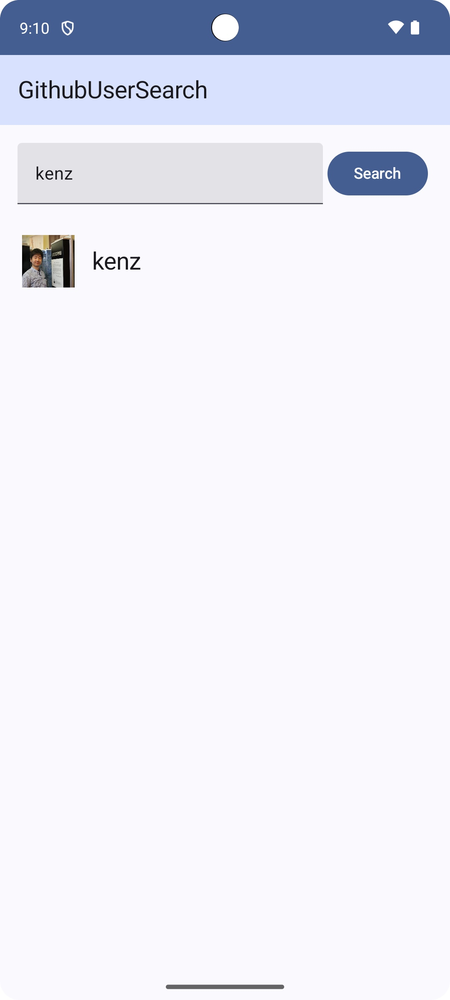
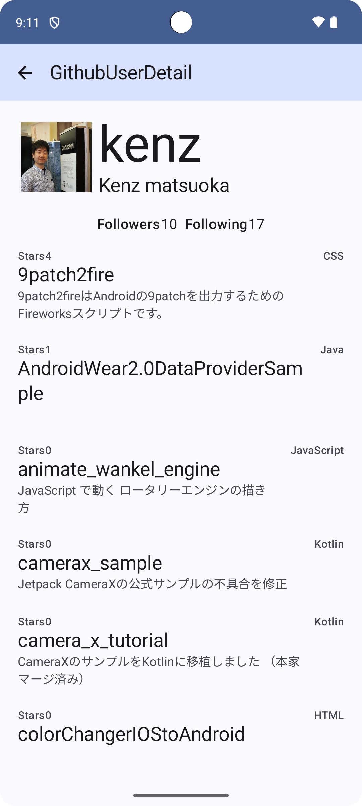
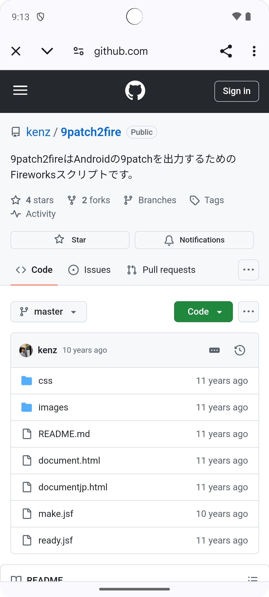

# What's This Repository
This repository is for my Jetpack Compose training.

# What's GithubWatcher
## Search Github User
Show github users list when set keyword and tap search button.


## User Detail and Repositories
Show user detail and unforked repositories that tapped user on previous screen.


## Repository
Open Repository page in Github that tapped repository on previous screen.


# Directory
```
├── app Applications root directory  
│   └── src Source code  
│       ├── androidTest not implemented yet.  
│       ├── main 
│       │   ├── java
│       │   │   ├── config should add Config.kt see #introduce
│       │   │   ├── data define model layer.
│       │   │   │   ├── di Inject repository.
│       │   │   │   ├── model Define data class.
│       │   │   │   └── repository Define method for data.
│       │   │   ├── event Event call from ui to viewmodel.
│       │   │   ├── network.
│       │   │   │   ├── di Inject netwrok module.
│       │   │   │   ├── models Define data class with outside API(Github).
│       │   │   │   └── retrofit Define network client.
│       │   │   └── ui Define compose.
│       │   │       └── Almost default.
│       │   └── res Use icon and strings.
│       └── test/java/org/firespeed/githubwatcher Unit test only few object yet.
├── gradle spec version of libraries.
└── doc for documents
```
# Introduce
First of all should add `YourConfig.kt` to ./app/src/main/java/org/firespeed/githubwatcher/config
And set your Github API Token.
ex:
```kotlin
object TestConfig : Config {
  override val API_TOKEN: String = "<YOUR_GITHUB_API_TOKEN>"
}
```

```sh
echo 'package org.firespeed.githubwatcher.config\n\nconst val API_TOKEN = API_TOKEN = "<YOUR_GITHUB_TOKEN>' > ./app/src/main/java/org/firespeed/githubwatcher/config/config.demo
```

# LICENSE
This repository is  distributed under the terms of the Apache License 2.0.
See the [LICENSE](LICENSE).